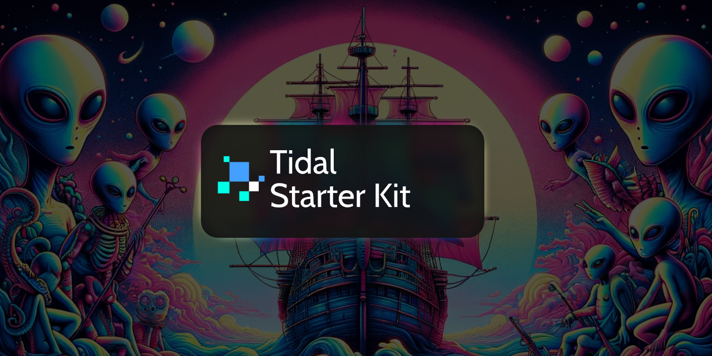

Tidal is a free, open-source, documentation-focused starter kit for Statamic. Tidal is designed to be used as a starting point and provides the following features:

* Manage documentation for multiple software projects
* Manage documentation for multiple versions *per* project

Tidal also supports Statamic's multi-site feature. If you are interested in using Tidal with multi-site you should use the [Tidal Multi-site](https://github.com/stillat/tidal-multisite) starter kit instead.

Happy documentation-writing!

## Installation and Documentation

Tidal's installation and documentation guide can be found online at https://stillat.com/tidal-starter-kit/v1/installation-and-upgrading

## License

Tidal is open-source software, released under the GPL-3.0 license.
